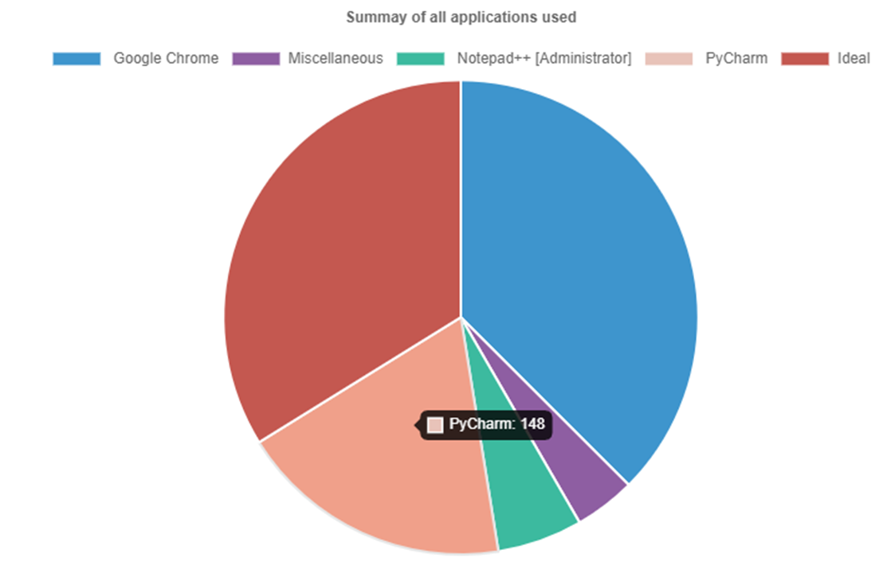
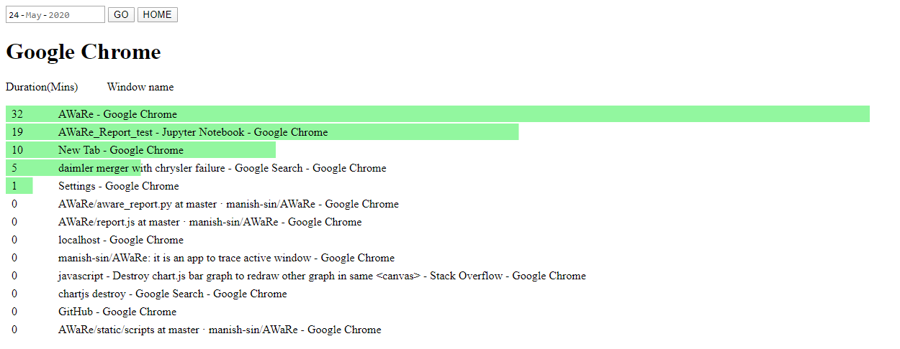
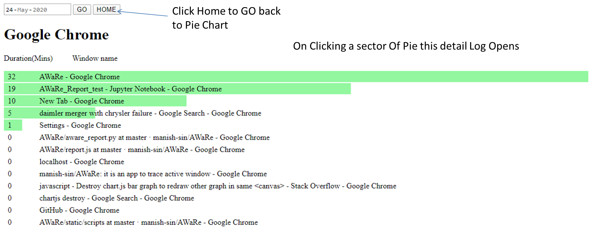

# Aware

Aware is a tool to help you monitor self-efficacy (your confidence to finish a task in target time) while working on PC.

### How does it work?
It 
  - logs the name of active window and duration of activity on it
  - produces a report of logs in a meaningful way
  - 
### Features

  - It works locally on your PC and does not require internet; Hence it is highly safe as it doesn't share data over the internet
  - The report is accessible on your browser itself
  - Reports are interactive and easy to explore, with a clean interface.
  - Configurable for "Start on PC startup"
  

### Use case

- Case 1: Every professional estimate the time he will require to finish a task, before hi start, whether the task it to ppt, Finish a report or photoshop an image He/she will be able to monitor that by knowing how long did he use certain applications to achieve his task. If this is done on a regular basis he/she will be able to calibrate his self-efficacy. 
For example: If I had decided to finish writing a certain part of this software, I should ask myself should I have taken 148 mins?
Fig 1:

- Case 2: Looking into detail of each app you can further filter out your NVA and distraction, like while doing a course, you spent more time on Netflix to freshen up. For me take away was I spent a lot of time searching emails, which means I have not organized my mail well (of course screenshot does not show my mail i.e ;). I will improve on that.
Fig 2: 

- Case 3: You may think of more and let us know ;)

### Instalation

### How to Turn Aware ON and OFF

### Exploring Report
To open the report, make sure Aware is running  and then hit "http://localhost:5000/". 
- Summary of all applications used

- Detail of App choosen

Note:
- The sector in pie chart named "Ideal" is time for which System was in sleep mode
- The sector in pie chart named "Miscellaneous" is aggregate of all apps Nun for less than 5 minutes
- Anny window open for less than 5 sec are not logged

### FAQ:
1. Why is there always a black window, while I run the Aware?
Ans: So that you are aware that your information is being logged. Information is precious. We thought to start Aware as service was not a good idea as of know.
2. Why report shows is only for 3 days?
Ans: We feel making a repository of such a report will lead to procrastination. Making this report temporarily motivates one to act to take decisions.
3. Does it track other activities such as Mouse?
Ans: No it doesn't track anything else accept Name of Active Window.
4. Is data logged by Aware safe?
Ans: All logs are saved on your PC locally, it not sent over the internet. The code for Aware is available, you may check it.
5. Some of the items among Horizontal bars has value zero, what does that mean?
Ans: All the values shown are in minutes, hence Zero minutes mean that windows were open for less than a minute.

